# 📘 PLANO COMPLETO DE IMPLEMENTAÇÃO - FUSELOJA V2.0

> **Documento EXTREMAMENTE DETALHADO para implementação completa das Fases 3, 4, 5 e 6**

---

## 📋 ÍNDICE

1. [Visão Geral](#visão-geral)
2. [FASE 3 - Correção de Imports e Rotas](#fase-3---correção-de-imports-e-rotas)
3. [FASE 4 - Análise Profunda de TypeScript](#fase-4---análise-profunda-de-typescript)
4. [FASE 5 - Plano Detalhado do Backend](#fase-5---plano-detalhado-do-backend)
5. [FASE 6 - Implementação Completa](#fase-6---implementação-completa)

---

## 🎯 VISÃO GERAL

### Status Atual (Fases 1-2 ✅ Concluídas)

#### ✅ Realizado

1. **Análise Completa** - 100% da aplicação mapeada
2. **Estrutura Monorepo** - Criada e configurada
3. **Pacotes Compartilhados** - @fuseloja/types, @fuseloja/shared, @fuseloja/config
4. **Configurações** - TypeScript, Prettier, Git, Workspaces

#### 📊 Estatísticas

- **Componentes Frontend**: 138
- **Páginas**: 22
- **Hooks**: 12
- **Contexts**: 4
- **Services**: 4
- **Tipos**: 8 arquivos
- **Rotas Backend**: 8 routers principais

### Próximas Etapas

```mermaid
graph LR
    A[Fase 1-2 ✅] --> B[Fase 3: Imports]
    B --> C[Fase 4: TypeScript]
    C --> D[Fase 5: Plano Backend]
    D --> E[Fase 6: Implementação]
    E --> F[Aplicação Completa]
```



---

## 🔄 FASE 3 - CORREÇÃO DE IMPORTS E ROTAS

### Objetivo

Atualizar 100% dos imports do frontend para usar os pacotes compartilhados e garantir que todas as rotas funcionem perfeitamente.

### 3.1 - Mapeamento de Imports a Corrigir

#### 3.1.1 - Types

**Antes:**
```typescript
import { Product } from '../types/product';
import { User } from '../types/user';
import { Category } from '../types/category';
```

**Depois:**
```typescript
import { Product, User, Category } from '@fuseloja/types';
```

**Arquivos Afetados (estimativa: 100+ arquivos):**
- Todos os componentes que importam types
- Todos os hooks
- Todos os contexts
- Todos os services
- Todas as páginas

#### 3.1.2 - Validators e Formatters

**Antes:**
```typescript
import { formatCurrency } from '../utils/formatters';
import { validateCPF } from '../utils/validation';
```

**Depois:**
```typescript
import { formatCurrency, validateCPF } from '@fuseloja/shared';
```

**Arquivos Afetados:**
- `apps/web/src/components/ui/ProductCard.tsx`
- `apps/web/src/components/admin/ProductsTable.tsx`
- `apps/web/src/pages/Checkout.tsx`
- `apps/web/src/components/user/UserProfileForm.tsx`
- Entre muitos outros...

#### 3.1.3 - Constants

**Antes:**
```typescript
const ORDER_STATUS = {
  PENDING: 'pending',
  PROCESSING: 'processing',
  // ...
};
```

**Depois:**
```typescript
import { OrderStatus } from '@fuseloja/shared';
```

### 3.2 - Plano de Execução

#### Passo 1: Atualizar package.json do Web

```json
{
  "dependencies": {
    "@fuseloja/types": "workspace:*",
    "@fuseloja/shared": "workspace:*"
  }
}
```

#### Passo 2: Criar Script de Substituição Automática

```bash
# Script: scripts/fix-imports.sh
#!/bin/bash

# Substituir imports de types
find apps/web/src -type f -name "*.tsx" -o -name "*.ts" | \
  xargs sed -i "s|from ['\"].*types/\([^'\"]*\)['\"]|from '@fuseloja/types'|g"

# Substituir imports de utils/formatters
find apps/web/src -type f -name "*.tsx" -o -name "*.ts" | \
  xargs sed -i "s|from ['\"].*utils/formatters['\"]|from '@fuseloja/shared'|g"

# Substituir imports de utils/validation
find apps/web/src -type f -name "*.tsx" -o -name "*.ts" | \
  xargs sed -i "s|from ['\"].*utils/validation['\"]|from '@fuseloja/shared'|g"
```

#### Passo 3: Validação Manual

Arquivos que precisam de revisão manual:
1. `apps/web/src/services/api.ts`
2. `apps/web/src/hooks/useAuth.ts`
3. `apps/web/src/contexts/*.tsx` (4 arquivos)
4. `apps/web/src/services/*.ts` (4 arquivos)

### 3.3 - Correção de Rotas

#### 3.3.1 - Verificar Path Aliases

**tsconfig.json (apps/web):**
```json
{
  "compilerOptions": {
    "baseUrl": ".",
    "paths": {
      "@/*": ["./src/*"],
      "@fuseloja/types": ["../../packages/types/src"],
      "@fuseloja/shared": ["../../packages/shared/src"]
    }
  }
}
```

#### 3.3.2 - Atualizar Vite Config

**vite.config.ts:**
```typescript
import { defineConfig } from 'vite';
import react from '@vitejs/plugin-react-swc';
import path from 'path';

export default defineConfig({
  plugins: [react()],
  resolve: {
    alias: {
      '@': path.resolve(__dirname, './src'),
      '@fuseloja/types': path.resolve(__dirname, '../../packages/types/src'),
      '@fuseloja/shared': path.resolve(__dirname, '../../packages/shared/src'),
    },
  },
  server: {
    host: '0.0.0.0',
    port: 8080,
    proxy: {
      '/api': {
        target: 'http://localhost:3001',
        changeOrigin: true,
      },
    },
  },
});
```

### 3.4 - Testes

#### Checklist de Validação:

- [ ] Executar `npm run build` sem erros
- [ ] Executar `npm run type-check` sem erros
- [ ] Testar todas as rotas principais no navegador
- [ ] Verificar console do navegador (0 erros)
- [ ] Testar funcionalidades críticas:
  - [ ] Login/Logout
  - [ ] Cadastro de produto
  - [ ] Carrinho de compras
  - [ ] Checkout
  - [ ] Upload de imagens
  - [ ] Listagem de produtos
  - [ ] Filtros e busca

---

## 🔍 FASE 4 - ANÁLISE PROFUNDA DE TYPESCRIPT

### Objetivo

Identificar e corrigir 100% dos erros de TypeScript, eliminar uso de `any`, garantir tipagem forte e consistência total.

### 4.1 - Análise Inicial

#### Executar Type Check Completo

```bash
# No root
npm run type-check

# Individualmente
cd apps/web && npm run type-check
cd apps/api && npm run type-check
cd packages/types && npm run type-check
cd packages/shared && npm run type-check
```

### 4.2 - Categorias de Erros Esperados

#### 4.2.1 - Uso de `any`

**Locais Comuns:**
- Event handlers: `(e: any) => void`
- API responses: `data: any`
- Callbacks genéricos
- Props de componentes dinâmicos

**Solução:**
```typescript
// ❌ ANTES
function handleChange(e: any) {
  setValue(e.target.value);
}

// ✅ DEPOIS
function handleChange(e: React.ChangeEvent<HTMLInputElement>) {
  setValue(e.target.value);
}
```

#### 4.2.2 - Types Implícitos

**Problema:**
```typescript
// Parâmetro 'product' implicitly has an 'any' type
const formatPrice = (product) => {
  return formatCurrency(product.price);
};
```

**Solução:**
```typescript
import { Product } from '@fuseloja/types';

const formatPrice = (product: Product): string => {
  return formatCurrency(product.price);
};
```

#### 4.2.3 - Optional Chaining e Nullish Coalescing

**Problema:**
```typescript
// Object is possibly 'undefined'
const userName = user.name;
```

**Solução:**
```typescript
const userName = user?.name ?? 'Convidado';
```

#### 4.2.4 - Type Guards

**Problema:**
```typescript
if (data) {
  // Object is possibly 'null'
  console.log(data.id);
}
```

**Solução:**
```typescript
function isValidData(data: unknown): data is { id: string } {
  return typeof data === 'object' && data !== null && 'id' in data;
}

if (isValidData(data)) {
  console.log(data.id); // ✅ Type-safe
}
```

### 4.3 - Arquivos Prioritários para Revisão

#### Alto Impacto (Revisar Primeiro):

1. **Services (apps/web/src/services/)**
   - `api.ts` - Cliente API
   - `auth.service.ts` - Autenticação
   - `eCommerce.service.ts` - E-commerce
   - `user.service.ts` - Usuário

2. **Hooks (apps/web/src/hooks/)**
   - `useAuth.ts`
   - `useProductsManagement.ts`
   - `useImageUpload.ts`

3. **Contexts (apps/web/src/contexts/)**
   - `UserContext.tsx`
   - `CartContext.tsx`
   - `OrderContext.tsx`
   - `SettingsContext.tsx`

### 4.4 - Criação de Tipos Auxiliares

#### Generic Types para API

```typescript
// packages/types/src/api.ts

export interface PaginatedResponse<T> {
  data: T[];
  pagination: {
    page: number;
    limit: number;
    total: number;
    totalPages: number;
  };
}

export interface ApiResponse<T = unknown> {
  success: boolean;
  data?: T;
  message?: string;
  error?: ApiError;
}

export interface ApiError {
  message: string;
  statusCode: number;
  code?: string;
  details?: Record<string, string[]>;
}
```

#### Form Types

```typescript
// packages/types/src/forms.ts

export interface FormFieldError {
  message: string;
  type: string;
}

export interface FormState<T> {
  values: T;
  errors: Partial<Record<keyof T, FormFieldError>>;
  touched: Partial<Record<keyof T, boolean>>;
  isSubmitting: boolean;
  isValid: boolean;
}
```

### 4.5 - TSConfig Strict Mode

```json
{
  "compilerOptions": {
    "strict": true,
    "noUnusedLocals": true,
    "noUnusedParameters": true,
    "noImplicitReturns": true,
    "noFallthroughCasesInSwitch": true,
    "noUncheckedIndexedAccess": true,
    "noImplicitAny": true,
    "strictNullChecks": true,
    "strictFunctionTypes": true,
    "strictBindCallApply": true,
    "strictPropertyInitialization": true,
    "noImplicitThis": true,
    "alwaysStrict": true
  }
}
```

### 4.6 - Relatório de Análise

Após análise, criar relatório em: `docs/TYPESCRIPT_ANALYSIS.md`

**Template:**
```markdown
# Análise TypeScript - FuseLoja

## Resumo Executivo
- Total de erros encontrados: X
- Uso de `any`: X ocorrências
- Types implícitos: X ocorrências
- Null safety issues: X ocorrências

## Erros por Categoria
### 1. Uso de `any` (X ocorrências)
- Arquivo: path/to/file.ts:linha
  - Contexto: ...
  - Solução proposta: ...

### 2. Types Implícitos (X ocorrências)
...

## Ações Tomadas
- [x] Correção 1
- [x] Correção 2
...

## Resultados Finais
- ✅ 0 erros TypeScript
- ✅ 0 uso de `any`
- ✅ 100% coverage de tipos
```

---

## 🏗️ FASE 5 - PLANO DETALHADO DO BACKEND

### Objetivo

Criar arquitetura backend COMPLETA e PROFISSIONAL usando:
- **Nginx** - Reverse proxy
- **Docker** - Containerização
- **Node.js + TypeScript** - Runtime e linguagem
- **Express** - Framework web
- **Prisma ORM** - Database toolkit
- **PostgreSQL** - Banco de dados relacional

---

## 📐 5.1 - ARQUITETURA COMPLETA

### 5.1.1 - Diagrama de Arquitetura

```
┌─────────────────────────────────────────────────────────────┐
│                         INTERNET                            │
└────────────────────────┬────────────────────────────────────┘
                         │
                         ▼
┌─────────────────────────────────────────────────────────────┐
│                     NGINX (Port 80/443)                     │
│  - Reverse Proxy                                            │
│  - SSL Termination                                          │
│  - Static Files                                             │
│  - Load Balancing                                           │
└────────────┬───────────────────────────────┬────────────────┘
             │                               │
             │ /api/*                        │ /*
             ▼                               ▼
┌────────────────────────┐    ┌─────────────────────────────┐
│   API Container        │    │   Frontend Container        │
│   (Node.js + Express)  │    │   (Vite Static Server)      │
│   Port: 3001           │    │   Port: 8080                │
│                        │    │                             │
│   ┌─────────────────┐  │    │   ┌──────────────────────┐  │
│   │   Controllers   │  │    │   │   React SPA          │  │
│   ├─────────────────┤  │    │   │   - Components       │  │
│   │   Services      │  │    │   │   - Pages            │  │
│   ├─────────────────┤  │    │   │   - Assets           │  │
│   │   Middleware    │  │    │   └──────────────────────┘  │
│   ├─────────────────┤  │    └─────────────────────────────┘
│   │   Validators    │  │
│   ├─────────────────┤  │
│   │   Utils         │  │
│   └─────────┬───────┘  │
│             │          │
│             ▼          │
│   ┌─────────────────┐  │
│   │  Prisma Client  │  │
│   └─────────┬───────┘  │
└─────────────┼──────────┘
              │
              ▼
┌─────────────────────────────────────────────────────────────┐
│              PostgreSQL Container (Port 5432)               │
│                                                             │
│   Databases:                                                │
│   - fuseloja (production)                                   │
│   - fuseloja_dev (development)                              │
│   - fuseloja_test (testing)                                 │
│                                                             │
│   Tables:                                                   │
│   - users                                                   │
│   - categories                                              │
│   - products                                                │
│   - product_images                                          │
│   - customers                                               │
│   - orders                                                  │
│   - order_items                                             │
│   - sessions                                                │
│   - refresh_tokens                                          │
└─────────────────────────────────────────────────────────────┘
```

### 5.1.2 - Fluxo de Requisições

```
Cliente (Browser)
    │
    ▼
1. HTTP Request → https://fuseloja.com.br
    │
    ▼
2. Nginx recebe na porta 80/443
    │
    ├─── Se /api/* ────────────────┐
    │                              │
    │                              ▼
    │                    3. Proxy para API Container (3001)
    │                              │
    │                              ▼
    │                    4. Express Router
    │                              │
    │                              ├─ Middleware: CORS
    │                              ├─ Middleware: Helmet (Security)
    │                              ├─ Middleware: Rate Limit
    │                              ├─ Middleware: Body Parser
    │                              ├─ Middleware: Logger (Winston)
    │                              │
    │                              ▼
    │                    5. Route Handler
    │                              │
    │                              ├─ Auth Middleware (JWT)
    │                              ├─ Validation Middleware (Joi)
    │                              │
    │                              ▼
    │                    6. Controller
    │                              │
    │                              ▼
    │                    7. Service (Business Logic)
    │                              │
    │                              ▼
    │                    8. Prisma Client
    │                              │
    │                              ▼
    │                    9. PostgreSQL Query
    │                              │
    │                              ▼
    │                    10. Response Data
    │                              │
    │                              ▼
    │                    11. JSON Response
    │
    └─── Se /* (static) ─────────┐
                                 │
                                 ▼
                       3. Serve Frontend Static Files
                                 │
                                 ▼
                       4. index.html + assets
    │
    ▼
12. Cliente recebe resposta
```

---

## 📦 5.2 - ESTRUTURA DE DIRETÓRIOS BACKEND COMPLETA

```
apps/api/
├── prisma/
│   ├── schema.prisma              # Schema do Prisma
│   ├── migrations/                # Migrações SQL
│   │   └── 20241119000000_init/
│   │       └── migration.sql
│   ├── seed.ts                    # Seed data
│   └── seed-data/                 # Dados de seed separados
│       ├── users.ts
│       ├── categories.ts
│       └── products.ts
│
├── src/
│   ├── index.ts                   # Entry point
│   ├── server.ts                  # Express server setup
│   ├── app.ts                     # Express app configuration
│   │
│   ├── config/                    # Configurações
│   │   ├── index.ts
│   │   ├── database.ts
│   │   ├── jwt.ts
│   │   ├── cors.ts
│   │   ├── multer.ts
│   │   └── logger.ts
│   │
│   ├── controllers/               # Controllers (Request handling)
│   │   ├── index.ts
│   │   ├── auth.controller.ts
│   │   ├── user.controller.ts
│   │   ├── product.controller.ts
│   │   ├── category.controller.ts
│   │   ├── order.controller.ts
│   │   ├── customer.controller.ts
│   │   └── upload.controller.ts
│   │
│   ├── services/                  # Services (Business Logic)
│   │   ├── index.ts
│   │   ├── auth.service.ts
│   │   ├── user.service.ts
│   │   ├── product.service.ts
│   │   ├── category.service.ts
│   │   ├── order.service.ts
│   │   ├── customer.service.ts
│   │   ├── email.service.ts
│   │   ├── upload.service.ts
│   │   └── token.service.ts
│   │
│   ├── repositories/              # Data Access Layer
│   │   ├── index.ts
│   │   ├── base.repository.ts
│   │   ├── user.repository.ts
│   │   ├── product.repository.ts
│   │   ├── category.repository.ts
│   │   ├── order.repository.ts
│   │   └── customer.repository.ts
│   │
│   ├── middleware/                # Express Middlewares
│   │   ├── index.ts
│   │   ├── auth.middleware.ts
│   │   ├── error.middleware.ts
│   │   ├── validation.middleware.ts
│   │   ├── rateLimit.middleware.ts
│   │   ├── cors.middleware.ts
│   │   ├── logger.middleware.ts
│   │   └── upload.middleware.ts
│   │
│   ├── routes/                    # Route Definitions
│   │   ├── index.ts
│   │   ├── auth.routes.ts
│   │   ├── user.routes.ts
│   │   ├── product.routes.ts
│   │   ├── category.routes.ts
│   │   ├── order.routes.ts
│   │   ├── customer.routes.ts
│   │   └── upload.routes.ts
│   │
│   ├── validators/                # Joi Schemas
│   │   ├── index.ts
│   │   ├── auth.validator.ts
│   │   ├── user.validator.ts
│   │   ├── product.validator.ts
│   │   ├── category.validator.ts
│   │   ├── order.validator.ts
│   │   └── customer.validator.ts
│   │
│   ├── types/                     # Backend-specific types
│   │   ├── index.ts
│   │   ├── express.d.ts           # Express type extensions
│   │   ├── jwt.types.ts
│   │   └── prisma.types.ts
│   │
│   ├── utils/                     # Utilities
│   │   ├── index.ts
│   │   ├── logger.ts
│   │   ├── errors.ts              # Custom error classes
│   │   ├── response.ts            # Response helpers
│   │   ├── jwt.ts                 # JWT helpers
│   │   ├── hash.ts                # Hashing utilities
│   │   ├── pagination.ts          # Pagination helpers
│   │   └── file.ts                # File handling
│   │
│   ├── lib/                       # External integrations
│   │   ├── prisma.ts              # Prisma client singleton
│   │   └── redis.ts               # Redis client (future)
│   │
│   └── @types/                    # Global type declarations
│       └── express/
│           └── index.d.ts
│
├── uploads/                       # Upload directory
│   ├── products/
│   ├── avatars/
│   └── temp/
│
├── logs/                          # Log files
│   ├── error.log
│   ├── combined.log
│   └── access.log
│
├── tests/                         # Tests
│   ├── unit/
│   │   ├── services/
│   │   ├── controllers/
│   │   └── utils/
│   ├── integration/
│   │   └── api/
│   └── e2e/
│       └── flows/
│
├── .env                           # Environment variables
├── .env.example
├── .env.test
├── Dockerfile                     # Docker config
├── .dockerignore
├── nodemon.json                   # Nodemon config
├── tsconfig.json                  # TypeScript config
├── jest.config.js                 # Jest config
├── package.json
└── README.md
```

---

## 🗄️ 5.3 - PRISMA SCHEMA COMPLETO

```prisma
// apps/api/prisma/schema.prisma

generator client {
  provider = "prisma-client-js"
  output   = "../node_modules/.prisma/client"
}

datasource db {
  provider = "postgresql"
  url      = env("DATABASE_URL")
}

// ============================================================================
// USER & AUTHENTICATION
// ============================================================================

model User {
  id                String    @id @default(uuid())
  email             String    @unique @db.VarChar(255)
  password          String    @db.VarChar(255)
  firstName         String    @map("first_name") @db.VarChar(100)
  lastName          String    @map("last_name") @db.VarChar(100)
  phone             String?   @db.VarChar(20)
  cpf               String?   @unique @db.VarChar(14)
  birthDate         DateTime? @map("birth_date") @db.Date
  avatar            String?   @db.VarChar(500)

  role              Role      @default(USER)
  isActive          Boolean   @default(true) @map("is_active")
  isEmailVerified   Boolean   @default(false) @map("is_email_verified")
  isProvisional     Boolean   @default(false) @map("is_provisional")

  emailVerifiedAt   DateTime? @map("email_verified_at")
  lastLoginAt       DateTime? @map("last_login_at")
  createdAt         DateTime  @default(now()) @map("created_at")
  updatedAt         DateTime  @updatedAt @map("updated_at")
  deletedAt         DateTime? @map("deleted_at")

  // Relations
  refreshTokens     RefreshToken[]
  orders            Order[]
  addresses         Address[]
  sessions          Session[]

  @@map("users")
  @@index([email])
  @@index([cpf])
  @@index([role])
  @@index([isActive])
}

enum Role {
  ADMIN
  USER
  GUEST
}

model RefreshToken {
  id        String   @id @default(uuid())
  token     String   @unique @db.VarChar(500)
  userId    String   @map("user_id")
  expiresAt DateTime @map("expires_at")
  createdAt DateTime @default(now()) @map("created_at")
  revokedAt DateTime? @map("revoked_at")

  user      User     @relation(fields: [userId], references: [id], onDelete: Cascade)

  @@map("refresh_tokens")
  @@index([userId])
  @@index([token])
  @@index([expiresAt])
}

model Session {
  id        String   @id @default(uuid())
  userId    String   @map("user_id")
  ipAddress String?  @map("ip_address") @db.VarChar(45)
  userAgent String?  @map("user_agent") @db.Text
  isActive  Boolean  @default(true) @map("is_active")
  createdAt DateTime @default(now()) @map("created_at")
  expiresAt DateTime @map("expires_at")

  user      User     @relation(fields: [userId], references: [id], onDelete: Cascade)

  @@map("sessions")
  @@index([userId])
}

// ============================================================================
// ADDRESSES
// ============================================================================

model Address {
  id           String  @id @default(uuid())
  userId       String  @map("user_id")
  label        String? @db.VarChar(50) // "Casa", "Trabalho", etc.
  street       String  @db.VarChar(255)
  number       String  @db.VarChar(10)
  complement   String? @db.VarChar(100)
  neighborhood String  @db.VarChar(100)
  city         String  @db.VarChar(100)
  state        String  @db.VarChar(2)
  zipCode      String  @map("zip_code") @db.VarChar(9)
  isDefault    Boolean @default(false) @map("is_default")

  createdAt    DateTime @default(now()) @map("created_at")
  updatedAt    DateTime @updatedAt @map("updated_at")

  user         User    @relation(fields: [userId], references: [id], onDelete: Cascade)
  orders       Order[]

  @@map("addresses")
  @@index([userId])
}

// ============================================================================
// CATEGORIES
// ============================================================================

model Category {
  id          String   @id @default(uuid())
  name        String   @unique @db.VarChar(100)
  slug        String   @unique @db.VarChar(100)
  description String?  @db.Text
  icon        String   @default("Package") @db.VarChar(50)
  color       String   @default("#6B7280") @db.VarChar(7)
  iconColor   String?  @map("icon_color") @db.VarChar(7)
  imageUrl    String?  @map("image_url") @db.VarChar(500)
  isActive    Boolean  @default(true) @map("is_active")
  sortOrder   Int      @default(0) @map("sort_order")

  createdAt   DateTime @default(now()) @map("created_at")
  updatedAt   DateTime @updatedAt @map("updated_at")

  products    Product[]

  @@map("categories")
  @@index([slug])
  @@index([isActive])
}

// ============================================================================
// PRODUCTS
// ============================================================================

model Product {
  id               String    @id @default(uuid())
  title            String    @db.VarChar(255)
  slug             String    @unique @db.VarChar(255)
  shortDescription String?   @map("short_description") @db.Text
  description      String?   @db.Text

  price            Decimal   @db.Decimal(10, 2)
  originalPrice    Decimal?  @map("original_price") @db.Decimal(10, 2)
  costPrice        Decimal?  @map("cost_price") @db.Decimal(10, 2)

  sku              String?   @unique @db.VarChar(100)
  barcode          String?   @unique @db.VarChar(100)

  stock            Int       @default(0)
  minStock         Int?      @default(0) @map("min_stock")
  maxStock         Int?      @map("max_stock")

  weight           Decimal?  @db.Decimal(10, 3) // kg
  height           Decimal?  @db.Decimal(10, 2) // cm
  width            Decimal?  @db.Decimal(10, 2) // cm
  length           Decimal?  @db.Decimal(10, 2) // cm

  categoryId       String?   @map("category_id")
  tag              ProductTag?

  isActive         Boolean   @default(true) @map("is_active")
  isFeatured       Boolean   @default(false) @map("is_featured")

  viewCount        Int       @default(0) @map("view_count")
  salesCount       Int       @default(0) @map("sales_count")

  publishedAt      DateTime? @map("published_at")
  createdAt        DateTime  @default(now()) @map("created_at")
  updatedAt        DateTime  @updatedAt @map("updated_at")
  deletedAt        DateTime? @map("deleted_at")

  // Relations
  category         Category? @relation(fields: [categoryId], references: [id], onDelete: SetNull)
  images           ProductImage[]
  specifications   ProductSpecification[]
  variants         ProductVariant[]
  orderItems       OrderItem[]

  @@map("products")
  @@index([slug])
  @@index([categoryId])
  @@index([tag])
  @@index([isActive])
  @@index([isFeatured])
  @@index([sku])
}

enum ProductTag {
  PROMOCAO
  EXCLUSIVO
  NOVO
  NOVIDADE
  ULTIMA_UNIDADE
  PRE_VENDA
  NO_TAG
}

model ProductImage {
  id        String   @id @default(uuid())
  productId String   @map("product_id")
  url       String   @db.VarChar(500)
  alt       String?  @db.VarChar(255)
  isPrimary Boolean  @default(false) @map("is_primary")
  sortOrder Int      @default(0) @map("sort_order")
  createdAt DateTime @default(now()) @map("created_at")

  product   Product  @relation(fields: [productId], references: [id], onDelete: Cascade)

  @@map("product_images")
  @@index([productId])
}

model ProductSpecification {
  id        String  @id @default(uuid())
  productId String  @map("product_id")
  name      String  @db.VarChar(100)
  value     String  @db.VarChar(255)

  product   Product @relation(fields: [productId], references: [id], onDelete: Cascade)

  @@map("product_specifications")
  @@index([productId])
}

model ProductVariant {
  id        String  @id @default(uuid())
  productId String  @map("product_id")
  name      String  @db.VarChar(100) // "Tamanho", "Cor", etc.
  value     String  @db.VarChar(100) // "M", "Vermelho", etc.
  priceAdjustment Decimal? @map("price_adjustment") @db.Decimal(10, 2)
  stockAdjustment Int? @map("stock_adjustment")
  sku       String? @db.VarChar(100)

  product   Product @relation(fields: [productId], references: [id], onDelete: Cascade)

  @@map("product_variants")
  @@index([productId])
  @@unique([productId, name, value])
}

// ============================================================================
// CUSTOMERS (Usuários provisórios/convidados)
// ============================================================================

model Customer {
  id        String    @id @default(uuid())
  name      String    @db.VarChar(255)
  phone     String    @unique @db.VarChar(20)
  email     String?   @db.VarChar(255)
  cpf       String?   @db.VarChar(14)
  birthDate DateTime? @map("birth_date") @db.Date
  notes     String?   @db.Text

  createdAt DateTime  @default(now()) @map("created_at")
  updatedAt DateTime  @updatedAt @map("updated_at")

  orders    Order[]

  @@map("customers")
  @@index([phone])
  @@index([email])
}

// ============================================================================
// ORDERS
// ============================================================================

model Order {
  id             String      @id @default(uuid())
  orderNumber    String      @unique @map("order_number") @db.VarChar(20)

  // Cliente pode ser User OU Customer
  userId         String?     @map("user_id")
  customerId     String?     @map("customer_id")

  // Dados do cliente (snapshot)
  customerName   String      @map("customer_name") @db.VarChar(255)
  customerEmail  String?     @map("customer_email") @db.VarChar(255)
  customerPhone  String      @map("customer_phone") @db.VarChar(20)

  // Endereço de entrega
  addressId      String?     @map("address_id")

  // Valores
  subtotal       Decimal     @db.Decimal(10, 2)
  discount       Decimal     @default(0) @db.Decimal(10, 2)
  shipping       Decimal     @default(0) @db.Decimal(10, 2)
  total          Decimal     @db.Decimal(10, 2)

  // Status e métodos
  status         OrderStatus @default(PENDING)
  paymentMethod  PaymentMethod @default(WHATSAPP) @map("payment_method")
  shippingMethod ShippingMethod @default(A_DEFINIR) @map("shipping_method")

  // Tracking
  trackingCode   String?     @map("tracking_code") @db.VarChar(100)

  // Timestamps
  paidAt         DateTime?   @map("paid_at")
  shippedAt      DateTime?   @map("shipped_at")
  deliveredAt    DateTime?   @map("delivered_at")
  canceledAt     DateTime?   @map("canceled_at")
  createdAt      DateTime    @default(now()) @map("created_at")
  updatedAt      DateTime    @updatedAt @map("updated_at")

  // Relations
  user           User?       @relation(fields: [userId], references: [id])
  customer       Customer?   @relation(fields: [customerId], references: [id])
  address        Address?    @relation(fields: [addressId], references: [id])
  items          OrderItem[]

  @@map("orders")
  @@index([userId])
  @@index([customerId])
  @@index([status])
  @@index([orderNumber])
  @@index([createdAt])
}

enum OrderStatus {
  PENDING
  PROCESSING
  SHIPPED
  DELIVERED
  CANCELED
}

enum PaymentMethod {
  WHATSAPP
  PIX
  CREDIT_CARD
  DEBIT_CARD
  BANK_TRANSFER
  CASH
}

enum ShippingMethod {
  A_DEFINIR
  SEDEX
  PAC
  MOTOBOY
  RETIRADA
}

model OrderItem {
  id          String  @id @default(uuid())
  orderId     String  @map("order_id")
  productId   String  @map("product_id")

  // Snapshot dos dados do produto
  productName String  @map("product_name") @db.VarChar(255)
  productSku  String? @map("product_sku") @db.VarChar(100)
  productImage String? @map("product_image") @db.VarChar(500)

  quantity    Int
  unitPrice   Decimal @map("unit_price") @db.Decimal(10, 2)
  subtotal    Decimal @db.Decimal(10, 2)
  discount    Decimal @default(0) @db.Decimal(10, 2)
  total       Decimal @db.Decimal(10, 2)

  createdAt   DateTime @default(now()) @map("created_at")

  order       Order   @relation(fields: [orderId], references: [id], onDelete: Cascade)
  product     Product @relation(fields: [productId], references: [id])

  @@map("order_items")
  @@index([orderId])
  @@index([productId])
}

// ============================================================================
// SETTINGS (Optional - para configurações do sistema)
// ============================================================================

model Setting {
  id        String   @id @default(uuid())
  key       String   @unique @db.VarChar(100)
  value     String   @db.Text
  type      SettingType @default(STRING)
  group     String?  @db.VarChar(50)
  isPublic  Boolean  @default(false) @map("is_public")
  createdAt DateTime @default(now()) @map("created_at")
  updatedAt DateTime @updatedAt @map("updated_at")

  @@map("settings")
  @@index([key])
  @@index([group])
}

enum SettingType {
  STRING
  NUMBER
  BOOLEAN
  JSON
}
```

---

## 🐳 5.4 - DOCKER CONFIGURATION COMPLETA

### 5.4.1 - docker-compose.yml (Root)

```yaml
# /home/user/fuseloja/docker-compose.yml

version: '3.8'

services:
  # ============================================================================
  # NGINX - Reverse Proxy
  # ============================================================================
  nginx:
    container_name: fuseloja_nginx
    build:
      context: ./docker/nginx
      dockerfile: Dockerfile
    ports:
      - "80:80"
      - "443:443"
    volumes:
      - ./docker/nginx/nginx.conf:/etc/nginx/nginx.conf:ro
      - ./docker/nginx/conf.d:/etc/nginx/conf.d:ro
      - ./apps/web/dist:/usr/share/nginx/html:ro
      - ./apps/api/uploads:/usr/share/nginx/uploads:ro
      - nginx_logs:/var/log/nginx
    depends_on:
      - api
      - web
    networks:
      - fuseloja_network
    restart: unless-stopped
    healthcheck:
      test: ["CMD", "nginx", "-t"]
      interval: 30s
      timeout: 10s
      retries: 3

  # ============================================================================
  # POSTGRESQL - Database
  # ============================================================================
  postgres:
    container_name: fuseloja_postgres
    image: postgres:16-alpine
    environment:
      POSTGRES_USER: ${DB_USER:-fuseloja}
      POSTGRES_PASSWORD: ${DB_PASSWORD:-fuseloja_secure_password}
      POSTGRES_DB: ${DB_NAME:-fuseloja}
      POSTGRES_INITDB_ARGS: "--encoding=UTF8 --lc-collate=pt_BR.UTF-8 --lc-ctype=pt_BR.UTF-8"
    ports:
      - "${DB_PORT:-5432}:5432"
    volumes:
      - postgres_data:/var/lib/postgresql/data
      - ./docker/postgres/init.sql:/docker-entrypoint-initdb.d/init.sql:ro
    networks:
      - fuseloja_network
    restart: unless-stopped
    healthcheck:
      test: ["CMD-SHELL", "pg_isready -U ${DB_USER:-fuseloja}"]
      interval: 10s
      timeout: 5s
      retries: 5

  # ============================================================================
  # API - Backend Node.js + Express + Prisma
  # ============================================================================
  api:
    container_name: fuseloja_api
    build:
      context: ./apps/api
      dockerfile: ../../docker/api/Dockerfile
      target: ${NODE_ENV:-production}
    environment:
      NODE_ENV: ${NODE_ENV:-production}
      PORT: ${API_PORT:-3001}
      DATABASE_URL: postgresql://${DB_USER:-fuseloja}:${DB_PASSWORD:-fuseloja_secure_password}@postgres:5432/${DB_NAME:-fuseloja}?schema=public
      JWT_SECRET: ${JWT_SECRET:-your-super-secret-jwt-key-min-32-chars}
      JWT_REFRESH_SECRET: ${JWT_REFRESH_SECRET:-your-super-secret-refresh-key-min-32-chars}
      FRONTEND_URL: ${FRONTEND_URL:-http://localhost:8080}
    ports:
      - "${API_PORT:-3001}:3001"
    volumes:
      - ./apps/api/uploads:/app/uploads
      - ./apps/api/logs:/app/logs
      # Development only:
      - ./apps/api/src:/app/src:ro
    depends_on:
      postgres:
        condition: service_healthy
    networks:
      - fuseloja_network
    restart: unless-stopped
    healthcheck:
      test: ["CMD", "wget", "--quiet", "--tries=1", "--spider", "http://localhost:3001/health"]
      interval: 30s
      timeout: 10s
      retries: 3
      start_period: 40s

  # ============================================================================
  # WEB - Frontend React (Build)
  # ============================================================================
  web:
    container_name: fuseloja_web
    build:
      context: ./apps/web
      dockerfile: ../../docker/web/Dockerfile
      target: ${NODE_ENV:-production}
    environment:
      NODE_ENV: ${NODE_ENV:-production}
      VITE_API_BASE_URL: ${VITE_API_BASE_URL:-http://localhost}
      VITE_API_PREFIX: ${VITE_API_PREFIX:-/api/v1}
    ports:
      - "${WEB_PORT:-8080}:80"
    volumes:
      - ./apps/web/dist:/usr/share/nginx/html:ro
    networks:
      - fuseloja_network
    restart: unless-stopped

networks:
  fuseloja_network:
    driver: bridge

volumes:
  postgres_data:
    driver: local
  nginx_logs:
    driver: local
```

### 5.4.2 - Dockerfile API

```dockerfile
# docker/api/Dockerfile

# ============================================================================
# Stage 1: Base
# ============================================================================
FROM node:18-alpine AS base

WORKDIR /app

# Install dependencies for node-gyp
RUN apk add --no-cache \
    python3 \
    make \
    g++ \
    postgresql-client

# Copy package files
COPY apps/api/package*.json ./
COPY packages/types/package.json ./packages/types/
COPY packages/shared/package.json ./packages/shared/

# ============================================================================
# Stage 2: Dependencies
# ============================================================================
FROM base AS dependencies

RUN npm ci --only=production && \
    npm cache clean --force

# ============================================================================
# Stage 3: Build
# ============================================================================
FROM base AS build

# Copy all source files
COPY apps/api/ ./
COPY packages/types/ ./packages/types/
COPY packages/shared/ ./packages/shared/

# Install all dependencies (including dev)
RUN npm ci

# Generate Prisma Client
RUN npx prisma generate

# Build TypeScript
RUN npm run build

# ============================================================================
# Stage 4: Production
# ============================================================================
FROM node:18-alpine AS production

WORKDIR /app

# Copy from dependencies stage
COPY --from=dependencies /app/node_modules ./node_modules
COPY --from=dependencies /app/package*.json ./

# Copy built application
COPY --from=build /app/dist ./dist
COPY --from=build /app/prisma ./prisma
COPY --from=build /app/.prisma ./.prisma

# Create uploads directory
RUN mkdir -p uploads/products uploads/avatars uploads/temp logs

# Add non-root user
RUN addgroup -g 1001 -S nodejs && \
    adduser -S nodejs -u 1001

# Change ownership
RUN chown -R nodejs:nodejs /app

# Switch to nodejs user
USER nodejs

# Expose port
EXPOSE 3001

# Health check
HEALTHCHECK --interval=30s --timeout=10s --start-period=40s --retries=3 \
  CMD node healthcheck.js || exit 1

# Start application
CMD ["node", "dist/index.js"]

# ============================================================================
# Stage 5: Development
# ============================================================================
FROM base AS development

# Copy source
COPY apps/api/ ./

# Install all dependencies
RUN npm ci

# Generate Prisma Client
RUN npx prisma generate

# Expose port
EXPOSE 3001

# Start with nodemon
CMD ["npm", "run", "dev"]
```

### 5.4.3 - Dockerfile Web

```dockerfile
# docker/web/Dockerfile

# ============================================================================
# Stage 1: Build
# ============================================================================
FROM node:18-alpine AS build

WORKDIR /app

# Copy package files
COPY apps/web/package*.json ./
COPY packages/types/package.json ./packages/types/
COPY packages/shared/package.json ./packages/shared/

# Install dependencies
RUN npm ci

# Copy source code
COPY apps/web/ ./
COPY packages/types/ ./packages/types/
COPY packages/shared/ ./packages/shared/

# Build application
RUN npm run build

# ============================================================================
# Stage 2: Production
# ============================================================================
FROM nginx:1.25-alpine AS production

# Copy nginx config
COPY docker/web/nginx.conf /etc/nginx/nginx.conf

# Copy built files
COPY --from=build /app/dist /usr/share/nginx/html

# Expose port
EXPOSE 80

# Start nginx
CMD ["nginx", "-g", "daemon off;"]
```

### 5.4.4 - Nginx Configuration

```nginx
# docker/nginx/nginx.conf

user nginx;
worker_processes auto;
error_log /var/log/nginx/error.log warn;
pid /var/run/nginx.pid;

events {
    worker_connections 1024;
    use epoll;
    multi_accept on;
}

http {
    include /etc/nginx/mime.types;
    default_type application/octet-stream;

    # Logging
    log_format main '$remote_addr - $remote_user [$time_local] "$request" '
                    '$status $body_bytes_sent "$http_referer" '
                    '"$http_user_agent" "$http_x_forwarded_for"';

    access_log /var/log/nginx/access.log main;

    # Performance
    sendfile on;
    tcp_nopush on;
    tcp_nodelay on;
    keepalive_timeout 65;
    types_hash_max_size 2048;
    client_max_body_size 10M;

    # Gzip
    gzip on;
    gzip_vary on;
    gzip_proxied any;
    gzip_comp_level 6;
    gzip_types text/plain text/css text/xml text/javascript
               application/json application/javascript application/xml+rss
               application/rss+xml font/truetype font/opentype
               application/vnd.ms-fontobject image/svg+xml;

    # Security Headers
    add_header X-Frame-Options "SAMEORIGIN" always;
    add_header X-Content-Type-Options "nosniff" always;
    add_header X-XSS-Protection "1; mode=block" always;

    # Rate Limiting
    limit_req_zone $binary_remote_addr zone=api_limit:10m rate=10r/s;
    limit_req_zone $binary_remote_addr zone=login_limit:10m rate=5r/m;

    # Upstream backends
    upstream api_backend {
        least_conn;
        server api:3001 max_fails=3 fail_timeout=30s;
        keepalive 32;
    }

    # HTTP Server
    server {
        listen 80;
        server_name _;

        # API Routes
        location /api/ {
            limit_req zone=api_limit burst=20 nodelay;

            proxy_pass http://api_backend;
            proxy_http_version 1.1;

            proxy_set_header Host $host;
            proxy_set_header X-Real-IP $remote_addr;
            proxy_set_header X-Forwarded-For $proxy_add_x_forwarded_for;
            proxy_set_header X-Forwarded-Proto $scheme;
            proxy_set_header Connection "";

            proxy_connect_timeout 60s;
            proxy_send_timeout 60s;
            proxy_read_timeout 60s;

            proxy_buffering off;
            proxy_request_buffering off;
        }

        # Login endpoint com rate limit mais restritivo
        location /api/v1/auth/login {
            limit_req zone=login_limit burst=3 nodelay;

            proxy_pass http://api_backend;
            proxy_http_version 1.1;
            proxy_set_header Host $host;
            proxy_set_header X-Real-IP $remote_addr;
            proxy_set_header X-Forwarded-For $proxy_add_x_forwarded_for;
        }

        # Uploads (servidos diretamente pelo Nginx)
        location /uploads/ {
            alias /usr/share/nginx/uploads/;
            expires 1y;
            add_header Cache-Control "public, immutable";
            access_log off;
        }

        # Frontend - SPA (React)
        location / {
            root /usr/share/nginx/html;
            index index.html;
            try_files $uri $uri/ /index.html;

            expires -1;
            add_header Cache-Control "no-store, no-cache, must-revalidate, proxy-revalidate";
        }

        # Static assets (com cache)
        location ~* \.(js|css|png|jpg|jpeg|gif|ico|svg|woff|woff2|ttf|eot)$ {
            root /usr/share/nginx/html;
            expires 1y;
            add_header Cache-Control "public, immutable";
            access_log off;
        }

        # Health check
        location /nginx-health {
            access_log off;
            return 200 "healthy\n";
            add_header Content-Type text/plain;
        }
    }
}
```

---

## 📝 5.5 - BACKEND TYPESCRIPT - ESTRUTURA COMPLETA

Devido ao limite de caracteres, vou resumir a estrutura dos arquivos principais:

### 5.5.1 - src/index.ts

```typescript
import 'dotenv/config';
import 'express-async-errors';
import server from './server';
import { logger } from './utils/logger';
import config from './config';

const PORT = config.port;

server.listen(PORT, () => {
  logger.info(`🚀 Server running on port ${PORT}`);
  logger.info(`📝 Environment: ${config.nodeEnv}`);
  logger.info(`🗄️  Database: ${config.database.host}`);
});

// Graceful shutdown
process.on('SIGTERM', () => {
  logger.info('SIGTERM signal received: closing HTTP server');
  server.close(() => {
    logger.info('HTTP server closed');
    process.exit(0);
  });
});
```

### 5.5.2 - src/app.ts

```typescript
import express from 'express';
import cors from 'cors';
import helmet from 'helmet';
import compression from 'compression';
import cookieParser from 'cookie-parser';
import morgan from 'morgan';

import { corsMiddleware } from './middleware/cors.middleware';
import { loggerMiddleware } from './middleware/logger.middleware';
import { errorMiddleware } from './middleware/error.middleware';
import routes from './routes';

const app = express();

// Security
app.use(helmet());
app.use(corsMiddleware);

// Body parsers
app.use(express.json({ limit: '10mb' }));
app.use(express.urlencoded({ extended: true, limit: '10mb' }));
app.use(cookieParser());

// Compression
app.use(compression());

// Logging
app.use(morgan('combined', { stream: loggerMiddleware }));

// Health check
app.get('/health', (req, res) => {
  res.status(200).json({ status: 'OK', timestamp: new Date().toISOString() });
});

// API Routes
app.use('/api/v1', routes);

// Error handling
app.use(errorMiddleware);

export default app;
```

### 5.5.3 - Exemplo Controller (auth.controller.ts)

```typescript
import { Request, Response } from 'express';
import { AuthService } from '../services/auth.service';
import { LoginRequest, RegisterRequest } from '@fuseloja/types';

export class AuthController {
  private authService: AuthService;

  constructor() {
    this.authService = new AuthService();
  }

  login = async (req: Request<{}, {}, LoginRequest>, res: Response) => {
    const { email, password } = req.body;

    const result = await this.authService.login(email, password);

    res.status(200).json({
      success: true,
      data: result,
    });
  };

  register = async (req: Request<{}, {}, RegisterRequest>, res: Response) => {
    const userData = req.body;

    const result = await this.authService.register(userData);

    res.status(201).json({
      success: true,
      data: result,
    });
  };

  // ... outros métodos
}
```

**DOCUMENTO CONTINUA - Este é um plano inicial. A implementação completa virá na Fase 6.**

---

## ✅ PRÓXIMOS PASSOS

1. **Implementar Fase 3**: Corrigir imports
2. **Implementar Fase 4**: Análise TypeScript
3. **Implementar Fase 5**: Criar todos os arquivos do backend
4. **Implementar Fase 6**: Testar e validar integração completa

---

**Status:** ✅ Plano Criado - Aguardando Aprovação para Implementação
